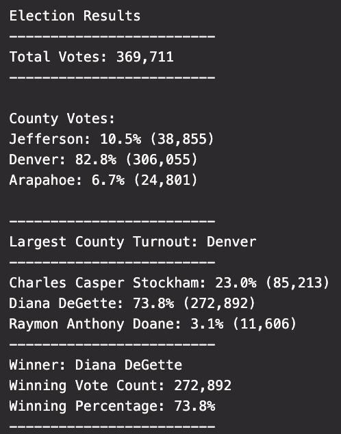

# Election Analysis with Python

## Project Overview

### Purpose

The objective of this project was use Python to read a CSV file of election data and count the total number of votes cast, create a list of candidates who received votes, count the total number of votes that each candidate received, what percentage of the toal votes each candidate received, and determine a winning candidate based on popular vote. Later, we determined the total amount of votes cast in each county, the percentage of votes from each county out of the total count, and identified the county with the largest number of votes cast.Lastly, we wrote these results to a text file for the election commission.

### Resources

- Data Source: [election_results.csv](Resources/election_results.csv)
- Software: Python 3.7.0, Visual Studio Code 1.52.1

## Election Audit Results

### Overview

From analyzing the election data we determined:
- In this congressional election there were 369,711 votes
- The counties that voted:
  - Jefferson County cast 10.5% of the votes (38,885 total votes)
  - Denver County cast 82.8% of the votes (306,055 total votes)
  - Arapahoe County cast 6.7% of the votes (24,801 total votes)
- The county with the largest number of votes was Denver County.
- The candidates and their vote totals were:
  - Charles Casper Stockham who received 85,213 votes which equates to 23.0% of the vote.
  - Diana DeGette who received 272,892 votes which equates to 73.8% of the vote.
  - Raymon Anthony Doane who received 11,606 votes which equates to 3.1% of the vote.
- Which candidate won the election, what was their vote count, and what was their percentage of the total votes?
- Diane DeGette was the popular vote winner with 73.8% of the vote (272,892 total votes)

An image of the election results text file that was written for the election commission follows:

## Election Audit Summary

### Statement

I think the greatest use of this script would be to modify it to work for broader elections. This would be done by adding a position column to the data we collect. We would initialize a `position_list = []` and loop to grab different position titles:
'''
    for row in reader:

        # Get the position title from each row.
        position_title = row[3]

        # If position title does not match any existing position add it to the position list
        if position_title not in position_list:

            # Add the position title to the position list.
            position_list.append(position_title)
'''

Another simpler way to modify the code would be to calculate the % of eligible voters that voted in each county. All you would need to know is the eligible voter population by county and adjust the code as follows:
'''
    for county_name in county_votes:

        # 6b: Retrieve the county vote count.
        c_votes = county_votes.get(county_name)

        # 6c: Calculate the percentage of eligible voters that voted.
        c_vote_percent = float(c_votes) / float(eligible_voter_pop) * 100

        # 6d: Print the county results to the terminal.
        county_results = (f"{county_name}: {c_vote_percent:.1f}% of eligible voter population ({c_votes:,})\n")
        
        print(county_results)
'''
